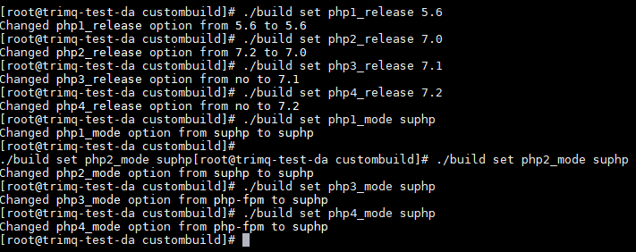
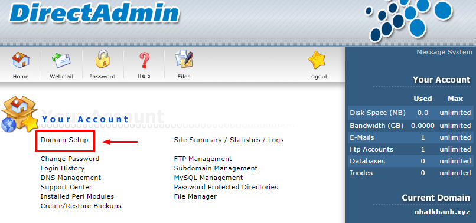
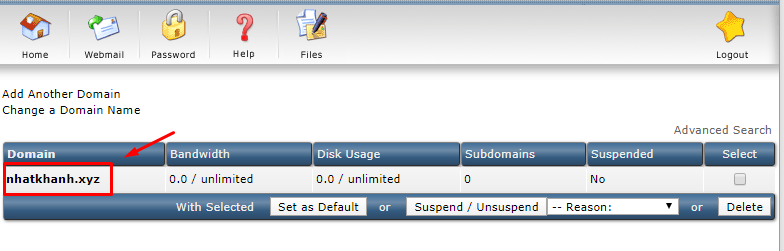
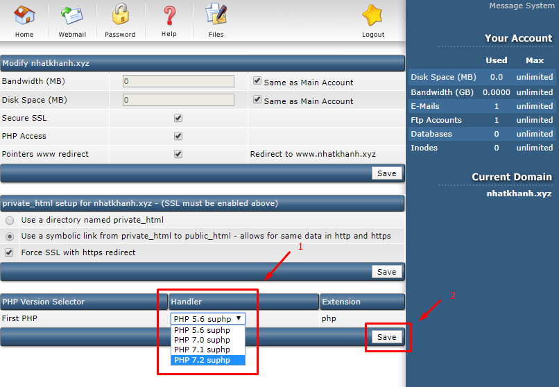

# **Cài đặt 4 Version PHP trên VPS sử dụng control Directadmin**

- Kể từ phiên bản **`1.56.0`** thì Directadmin đã hỗ trợ cùng lúc 4 phiên bản PHP (Với phiên bản Directadmin từ **`1.50`** đến **`1.55`** thì chỉ hỗ trợ tối đã 2 phiên bản PHP )

## **Bước 1 :** Cập nhật CustomBuild

```sh
cd /usr/local/directadmin/custombuild
./build update
```

## **Bước 2 :** Thiết lập các phiên bản PHP

- Tiếp theo, chạy các lệnh sau đây để thiết lập các phiên bản (Bạn có thể thay đổi các phiên bản PHP tương ứng theo nhu cầu của các bạn bao gồm: 5.3, 5.4, 5.5, 5.6, 7.0, 7.1, 7.2, 7.3)

```sh
./build set php1_release 5.6
./build set php2_release 7.0
./build set php3_release 7.1
./build set php4_release 7.2
./build set php1_mode suphp
./build set php2_mode suphp
./build set php3_mode suphp
./build set php4_mode suphp
```



## **Bước 3 :** Biên dịch lại PHP và viết lại cấu hình

```sh
./build set mod_ruid2 no
./build php d
./build apache d
./build rewrite_confs
```

## **Bước 4 :** Thiết lập các phiên bản PHP trên Directadmin

- Bây giờ bạn có thể chọn một phiên bản PHP cho website của bạn. Tất cả các trang web hiện đang chạy trên  DirectAdmin của bạn sẽ sử dụng mặc định giá trị đặt cho **`php1_release`** (Tức phiên bản PHP 5.6)

- Để thao tác chúng ta truy cập vào trong giao diện người dùng (User Level) trên control DirectAdmin Click chọn **`Domain Setup`** -> Tiếp theo Click vào domain đang cần thay đổi phiên bản PHP




- Sau đó trong phần **`PHP Version Selector`**  chọn đúng phiên bản PHP cần chạy -> **`Click Save`** để lưu lại



---
<a href="https://kb.nhanhoa.com/display/NHKB01/DirectAdmin" target="_blank">kb.nhanhoa.com</a>

Khi cần hỗ trợ xin liên hệ với chúng tôi:

**Công ty phần mềm Nhân Hòa**
- Trụ sở Hà Nội: 32 Võ Văn Dũng, Đống Đa, Hà Nội
- Chi nhánh HCM: 270 Cao Thắng (nối dài), Phường 12,Quận 10, TP HCM
- Hotline: `19006680`